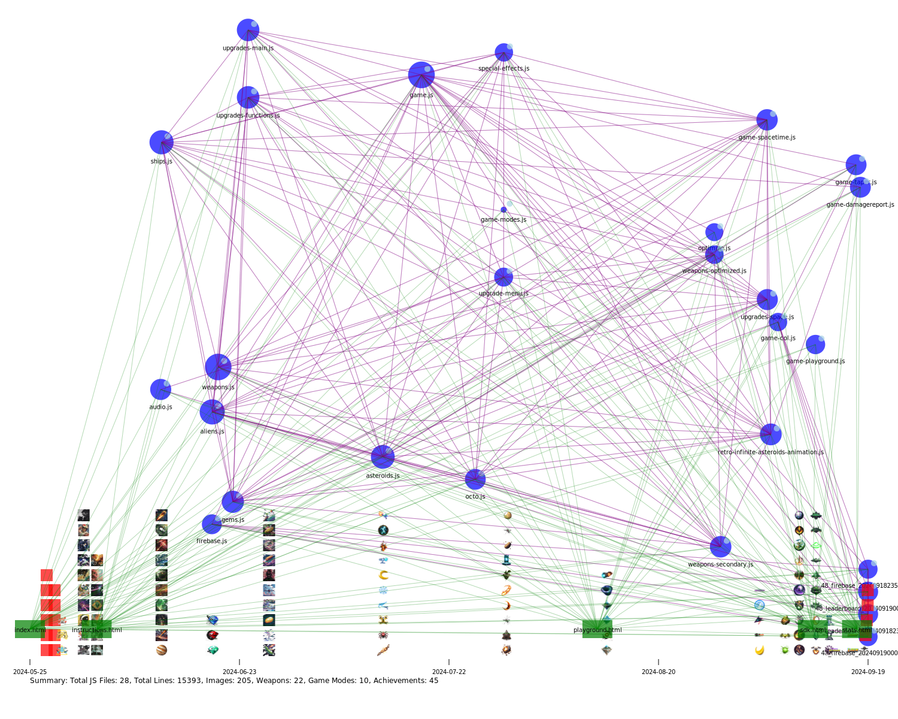

# Project Analysis Visualization

This SVG visualization represents the structure and timeline of the project files.

- Blue circles represent JavaScript files, with size indicating file complexity.
- Image thumbnails are shown at the bottom, aligned with their creation dates.
- Green rectangles represent HTML files.
- Purple lines show connections between related JavaScript files.
- Green lines show connections from HTML to JavaScript files.

The time axis at the bottom shows the project timeline.

# Tasks over time completion (via idl) 

# Infinite Asteroids Game Lifecycle

## 1. Game Login

- `handleUserLogin(id, username)`
  - `loadUserData(userId)`
    - `populateAchievements()`
    - `populateSelectors()`
    - `populateUserScores(last10Scores)`
  - `handleSelections()`

## 2. Game Start

- `initializeGame(mode, replay = false)`
  - `handleSelections()`
  - `multiplierCalculator(mode)`
  - `startGame()`
    - `initializeLastDamageReport()`
    - `createAsteroids()`
    - `resetShip()`
    - `clearInterval(gameLoop)`
    - `gameLoop = setInterval(update, 1000 / 60)`
      - `update()`
        - `calculateAndAdjustFPS()`
        - `drawBackground()`
        - `updateShip()`
        - `checkFloatingIslandSpawn()`
        - `updateFloatingIsland()`
        - `checkIslandCollision()`
        - `updateMegaUpgrades()`
        - `drawFloatingIsland()`
        - `drawActiveMegaUpgrades()`
        - `drawRareAsteroidIndicators()`
        - `drawMegaExplosions()`
        - `updateGems()`
        - `drawGems()`
        - `updateSonicBlast()`
        - `drawSonicBlast()`
        - `updateDeathRay()`
        - `updateExplosiveRockets()`
        - `drawExplosiveRockets()`
        - `updateAcidBombs()`
        - `updateAcidAreas()`
        - `drawAcidBombs()`
        - `drawAcidAreas()`
        - `updateFreezeEffect()`
        - `updateFlamethrower()`
        - `updateAsteroidFire()`
        - `drawActiveWeaponClasses()`
        - `updateBoomerang()`
        - `drawBoomerang()`
        - `updateLasers()`
        - `drawLasers()`
        - `updatenanoswarms()`
        - `drawnanoswarms()`
        - `updateTurret()`
        - `updateTurretLasers()`
        - `drawTurretLasers()`
        - `drawTurret()`
        - `updateBomberDrones()`
        - `drawBomberDrones()`
        - `updateDrones()`
        - `drawDrones()`
        - `updateAsteroids()`
        - `drawAsteroids()`
        - `checkLaserCollisions()`
        - `updateExplosions()`
        - `drawExplosions()`
        - `updateAliens()`
        - `updateAlienLasers()`
        - `drawAliens()`
        - `updateBossAlien()`
        - `drawBossAlien()`
        - `updateBossAlienLaser()`
        - `drawBossAlienLaser()`
        - `updateSuperBossAlien()`
        - `drawSuperBossAlien()`
        - `updateMegaBossAlien()`
        - `drawMegaBossAlien()`
        - `updateOctoBoss()`
        - `drawOctoBoss()`
        - `updateAndDrawParticles()`
        - `updateAndDrawShockwaves()`
        - `drawAlienLasers()`
        - `spawnAliens(wave)`
        - `checkForUpgradeSpawn()`
        - `recordWeaponDamageForWave()`
        - `updateParticles()`
        - `drawParticles()`
        - `drawLives()`
        - `drawScore()`
        - `updateAndDrawFloatingUpgrades()`
        - `checkGemCollection()`
        - `drawShip()`

## 3. Game End

- `endGame()`
  - `clearInterval(gameLoop)`
  - `resetShip()`
  - `updateAchievementsAtEnd()`
    - `addAchievement()` (for each relevant achievement)
  - `saveUserScore(userId, gameData)`
  - `loadLeaderboard(gameId, currentMode)`
  - `displayEndGameScreen(topWeapons, newlyUnlockedAchievements, newlyUnlockedWeapons)`
    - `calculateWeaponDPM()`
    - `displayAchievementsSequentially()`
  - `populateSelectors()`
  - `loadLeaderboard(gameId, currentMode)`

  # Statistics

  stats.html

  # Playground

  playground.html
